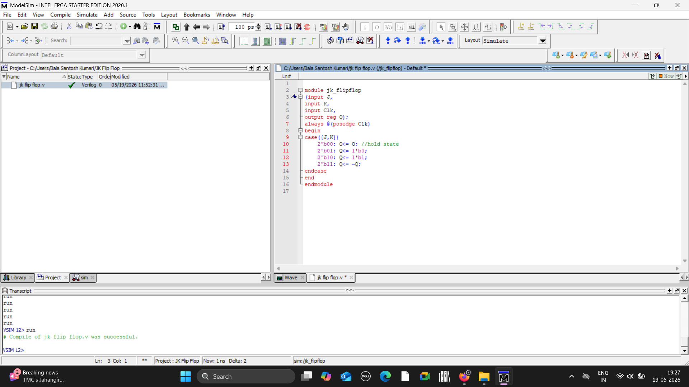
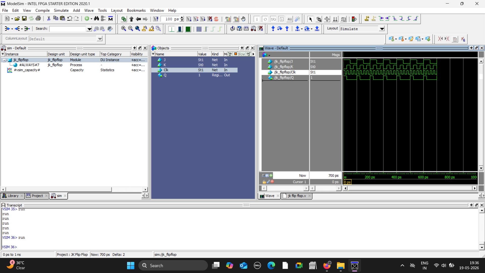

# JK FlipFlop using Verilog

## Objective
Implemented and stimulated a JK flip flop using Verilog HDL in Modelsim.

## Concepts used
- Sequential logic
- Flip Flop operation
- Toggle functionality

  

## Verilog Code 

## Simulation Waveform

## Results
Verilog set, reset, hold and toggle operations through simulation waveforms.

## Tools used
- Verilog HDL
- Modelsim
